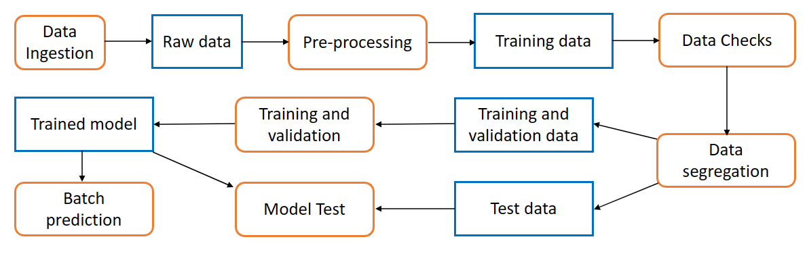
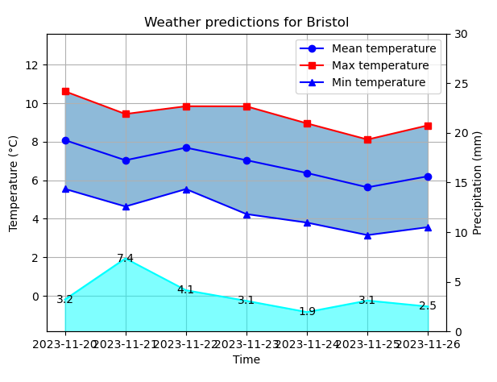
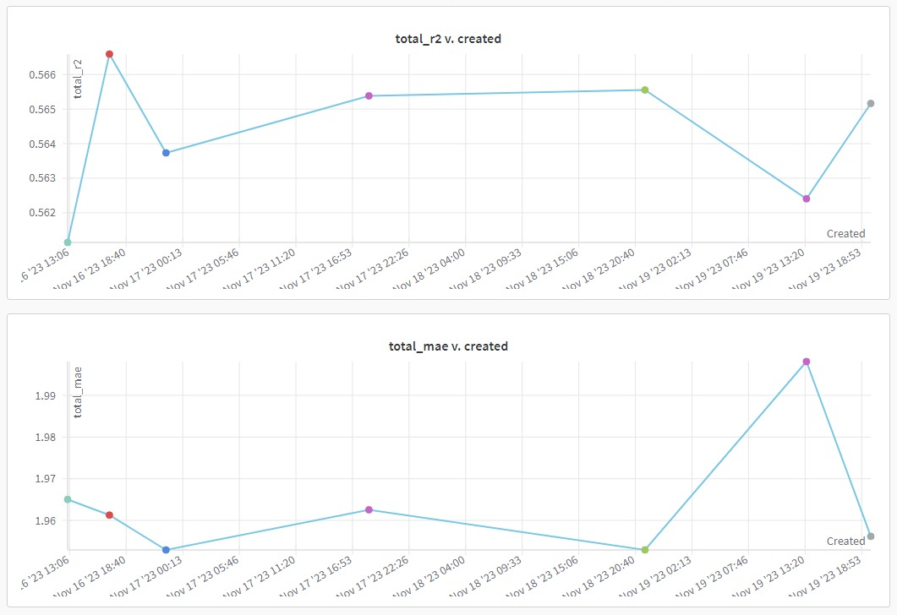

<h1 align='center'>Weather Prediction ML pipeline</h1>
<h3 align='center'>Orestas Dulinskas</h3>
<h4 align='center'>Novermber 2023</h4>

## Overview

This machine learning pipeline trains a model that aims to predict temperature and precipitation for 10 major cities in UK. The pipeline pulls data from API, process and tests it, trains and test a model and makes a batch prediction for next weeks weather. The trained model is then used to provide predictions using API requests.

## Table of contents

- [Pipeline](#pipeline)
  - [1. Data Ingestion](#1-data-ingestion)
  - [2. Pre-processing](#2-pre-processing)
  - [3. Data Checks](#3-data-checks)
  - [4. Data Segregation](#4-data-segregation)
  - [5. Training and Validation](#5-training-and-validation)
  - [6. Model Test](#6-model-test)
  - [7. Batch Prediction](#7-batch-prediction)
- [Reports](#reports)
- [Requirements](#requirements)
- [Tools](#tools)
- [Installation](#installation)
  - [1. Download and install Miniconda](#1-download-and-install-miniconda)
  - [2. Clone the project and set up the environment](#2-clone-the-project-and-set-up-the-environment)
  - [3. Set up Weights and Biases authorization](#3-set-up-weights-and-biases-authorisation)
- [Usage](#usage)
  - [Retrain Model](#retrain-model)
- [Contact](#contact)

## Pipeline



#### 1. Data Ingestion

This script pulls the latest weather data from Historical data API (https://open-meteo.com/).

##### 2. Pre-processing

This script cleans, processes and engineers training data.

##### 3. Data Checks

The script runs deterministic and statistical tests on the data to ensure its integrity.

##### 4. Data segregation

This script splits the provided dataset into a test set and a remaining set.

##### 5. Training and Validation

This script trains and validates the model

##### 6. Model test

The trained model is tested against the test dataset. If the model demonstrates better performance in terms of R-squared score and Mean Absolute Error (MAE) compared to previous models, it is promoted for production use. Data slice and model drift tests are also conducted to validate the model's performance.

##### 7. Batch prediction

This script predicts upcoming week's weather and generates a visualisation of that prediction.



## Reports

The pipeline generates various metrics to track model performance and logs pipeline steps to track the pipeline is running accordingly

- Ingestion records: The report records all API pull requests and the date range of the data pulled.
- Logs: This report is generated with the date of the run as the file name. It lists all the detailed steps in the pipeline run to track it and trace back the issue in case of an error.
- Model performance: New model performance metric (MAE and R2) are added to the list in the report in order to keep track and changes of the performance. MAE measures the average absolute difference between the predicted and actual outcomes, while R2 indicates the proportion of the variance in the target variable that is predictable. A lower MAE value and a higher R2 value signify better model performance. These can be visualised in WandB dashboard as such:



## Requirements

The project requires Python 3.11.5 running on Ubuntu 22.04.3 LTS. It utilizes the latest version of Miniconda for environment management. Other dependencies are outlined in requirements.txt file.

## Tools

- `Github` - Version control, Code review, bug tracking and documentation.
- `Weights & Biases` - Track, visualise and optimise ML experiments. Log metrics, parameters, artifacts and models.
- `MLflow + Hydra` - ML pipelines and orchestration
- `conda` - Environment isolation and management
- `Scikit-learn` and `XGBoost` - Machine learning algorithms

## Installation

To install the project, follow these steps:

### 1. Download and install Miniconda

```bash
> wget https://repo.anaconda.com/miniconda/Miniconda3-latest-Linux-x86_64.sh
> chmod u+x Miniconda3-latest-Linux-x86_64.sh
> ./Miniconda3-latest-Linux-x86_64.sh -b
```

### 2. Clone the project and set-up the environment

Clone the project repository from `https://github.com/Orestas41/weather-prediction-ml-pipeline.git` by clicking on the 'Fork' button in the upper right corner. This will create a forked copy of the repository under your GitHub account. Clone the repository to your local machine:

```bash
> git clone https://github.com/[Your Github Username]/weather-prediction-ml-pipeline.git
> cd weather-prediction-ml-pipeline
> conda env create -f environment.yml
> conda activate weather-prediction
```

### 3. Set-up Weights and Biases authorisation

To run the pipeline successfully, you need to set up authorization for Weights & Biases (WandB). W&B is a machine learning development platform that enables real-time tracking and visualization of various aspects of the model training process. Obtain your API key from W&B by visiting https://wandb.ai/authorize and clicking on the '+' icon to copy the key to the clipboard. Then, use the following command to authenticate:

```bash
> wandb login [your API key]
```

## Usage

### Retrain model

To train or retrain the model, navigate to the root directory and run the following command:

```bash
> mlflow run .
```

To run pipeline steps separately, run the following command:

```bash
> mlflow run -P steps=[step name ex.:`data_ingestion`]
```

The pipeline will pull the latest match results from Historical weather API (https://open-meteo.com/), cleans and merges it with the existing training data, and performs model retraining from scratch. If the new model outperforms the previous versions based on metrics such as R-squared score and Mean Absolute Error (MAE), it will be promoted for production use.

## Contact

If you have any questions or problems, please contact orestasdulinskas@gmail.com